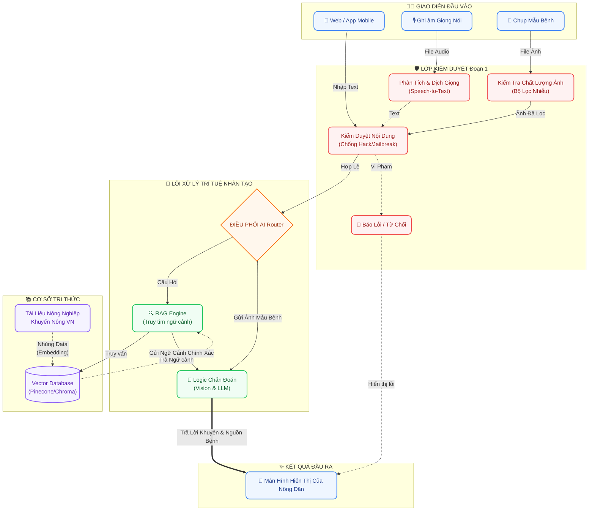

# 🌿 Nông Trí AI - Trợ lý Nông nghiệp Thông minh

Chào mừng bạn đến với dự án **Nông Trí AI** (ArgiAI). Đây là nền tảng ứng dụng công nghệ Trí tuệ Nhân tạo (AI) giúp bà con nông dân chẩn đoán sâu bệnh, tra cứu cẩm nang canh tác và nhận tư vấn trực tiếp từ Chuyên gia AI theo thời gian thực.

Dự án được cấu trúc theo mô hình **Microservices**, phân tách rõ ràng giữa giao diện người dùng (Frontend) và máy chủ xử lý dữ liệu (Backend).

---

## 🏗 Cấu trúc Hệ thống (Architecture)

### 1. Luồng hoạt động (Data Flow)
Sơ đồ dưới đây thể hiện luồng luân chuyển dữ liệu từ phía Nông dân (Mobile/Web) tới các phân hệ AI cốt lõi của Backend.



### 2. Cây thư mục (Directory Tree)
Toàn bộ mã nguồn dự án được đặt trong thư mục gốc `ArgiAI/` với 2 phân hệ chính:

```text
ArgiAI/
├── docs/                 # 📚 Tài liệu, thiết kế và kế hoạch dự án
├── frontend/             # 📱 Giao diện Web App (Kiến trúc DDD + Clean Architecture)
│   ├── public/           # Tài nguyên hình ảnh, biểu tượng
│   └── src/
│       ├── app/          # Tầng Routing (Next.js App Router)
│       ├── core/         # Lõi hệ thống (Cấu hình, HTTP client)
│       ├── shared/       # UI Components & Hooks dùng chung
│       └── modules/      # Các Domain nghiệp vụ (chat, diagnostics, handbook)
│
├── backend/              # ⚙️ Hệ thống API Server (FastAPI + Clean Architecture)
│   ├── app/
│   │   ├── core/         # Lõi hệ thống (Cấu hình env, Dependency Injection)
│   │   ├── shared/       # Error Handlers, Interfaces & Utils dùng chung
│   │   └── modules/      # Các Domain nghiệp vụ (chat, diagnostics, handbook)
│   ├── Dockerfile        # Cấu hình Docker
│   ├── requirements.txt  # Thư viện Python
│   └── README.md         # Tài liệu cấu trúc chi tiết Backend
│
├── docker-compose.yml    # File cấu hình chạy toàn bộ hệ thống
└── README.md             # 📍 Tài liệu tổng quan dự án
```

---

## 📱 Phân hệ Frontend 

Giao diện người dùng được thiết kế chuẩn mực theo phong cách **Premium Glassmorphism**, tối ưu hóa tuyệt đối cho trải nghiệm trên màn hình di động (Mobile Simulator) nhằm mang lại sự mượt mà và trực quan nhất.

### 🛠 Công nghệ sử dụng (Tech Stack)

- **Framework:** Next.js 15+ (App Router), React 19.
- **Kiến trúc:** Domain-Driven Design (DDD) kết hợp Frontend Clean Architecture.
- **State Management:** Zustand (Global State).
- **Data Fetching/Caching:** React Query (TanStack Query) cho Server State.
- **Styling:** Tailwind CSS.
- **Typography:** Be Vietnam Pro (tối ưu hiển thị tiếng Việt).
- **Animations:** Framer Motion (hiệu ứng chuyển động mượt mà).
- **Icons:** Lucide React.

---

## ⚙️ Phân hệ Backend (API Server)

Thư mục `backend/` được quy hoạch chuẩn mực theo kiến trúc **Domain-Driven Design (DDD)** kết hợp **Clean Architecture** và cơ chế **Dependency Injection**, đảm bảo khả năng mở rộng tối đa. Hệ thống tập trung tối ưu chi phí bằng các giải pháp AI mã nguồn mở.

### 🛠 Công nghệ sử dụng (Tech Stack)

- **Framework:** FastAPI (Python) siêu tốc độ, hỗ trợ Async. Tích hợp sẵn cơ chế **Dependency Injection** qua `Depends()`.
- **Kiến trúc:** Domain-Driven Design (DDD) kết hợp Backend Clean Architecture.
- **Trí tuệ nhân tạo (Lõi LLM & Vision):** Gemini 1.5 Flash (Xử lý ảnh và phân tích ngữ cảnh RAG cực tốt, tiết kiệm chi phí).
- **Voice-to-Text (Offline):** Faster-Whisper (Giải pháp mã nguồn mở chạy trực tiếp trên CPU, nhận diện tiếng Việt cực chuẩn mà không tốn phí API).
- **Vector Database (Mã nguồn mở):** ChromaDB lưu trữ cục bộ, phục vụ kiến trúc RAG không giới hạn.
- **AI Orchestrator:** LangChain/LangGraph điều phối luồng kiểm duyệt và tạo chuỗi suy luận.

---

## 🚀 Hướng dẫn Khởi chạy (Local Development)

### Khởi chạy toàn bộ hệ thống bằng Docker Compose (Khuyên dùng)
Cách nhanh nhất để chạy toàn bộ dự án (cả Frontend và Backend) ở môi trường Production mà không cần cấu hình phức tạp:

```bash
# Đứng tại thư mục gốc của dự án (ArgiAI)
docker compose up -d --build
```
Hệ thống sẽ tự động đóng gói và bật song song 2 máy chủ:
- 📱 **Giao diện Nông dân (Frontend)**: [http://localhost:3000](http://localhost:3000)
- ⚙️ **Hệ thống API (Backend Swagger)**: [http://localhost:8000/docs](http://localhost:8000/docs)

Để dừng toàn bộ hệ thống, chạy lệnh `docker compose down`.

---
### Khởi chạy thủ công từng phân hệ (Môi trường Dev)

#### 1. Chạy giao diện Frontend (Next.js)
Nếu bạn muốn code và xem thay đổi ngay lập tức (Hot-Reload):

```bash
# 1. Di chuyển vào thư mục frontend
cd frontend

# 2. Cài đặt các gói phụ thuộc
npm install

# 3. Khởi động máy chủ giao diện
npm run dev
```
Sau đó, mở trình duyệt tại: [http://localhost:3000](http://localhost:3000) để trải nghiệm.

#### 2. Chạy máy chủ Backend (FastAPI)
Mở một tab Terminal mới:

```bash
# 1. Di chuyển vào thư mục backend
cd backend

# 2. Tạo môi trường ảo và cài đặt thư viện
python3 -m venv venv
source venv/bin/activate  # (Windows: venv\Scripts\activate)
pip install -r requirements.txt

# 3. Tạo file biến môi trường (Cấu hình API Key nếu cần)
cp .env.example .env

# 4. Chạy server FastAPI
uvicorn app.main:app --reload --host 0.0.0.0 --port 8000
```
Truy cập tài liệu API tự động tại: [http://localhost:8000/docs](http://localhost:8000/docs).

---
*Dự án Nông Trí AI - Đồng hành cùng nền nông nghiệp Việt Nam.* 🌾
