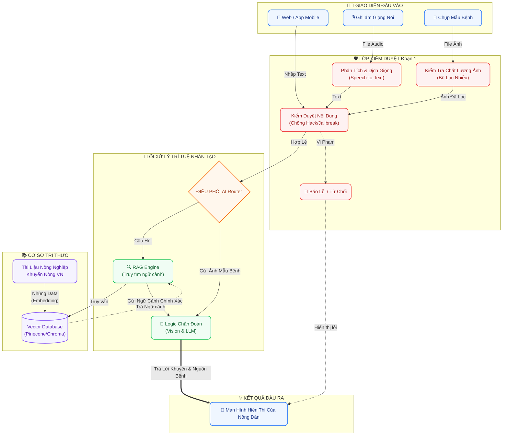

# 🌿 Nông Trí AI - Trợ lý Nông nghiệp Thông minh

Chào mừng bạn đến với dự án **Nông Trí AI** (ArgiAI). Đây là nền tảng ứng dụng công nghệ Trí tuệ Nhân tạo (AI) giúp bà con nông dân chẩn đoán sâu bệnh, tra cứu cẩm nang canh tác và nhận tư vấn trực tiếp từ Chuyên gia AI theo thời gian thực.

Dự án được cấu trúc theo mô hình **Microservices**, phân tách rõ ràng giữa giao diện người dùng (Frontend) và máy chủ xử lý dữ liệu (Backend).

---

## 🏗 Cấu trúc Hệ thống (Architecture)

### 1. Luồng hoạt động (Data Flow)
Sơ đồ dưới đây thể hiện luồng luân chuyển dữ liệu từ phía Nông dân (Mobile/Web) tới các phân hệ AI cốt lõi của Backend.



### 2. Cây thư mục (Directory Tree)
Toàn bộ mã nguồn dự án được đặt trong thư mục gốc `ArgiAI/` với 2 phân hệ chính:

```text
ArgiAI/
├── docs/                 # 📚 Tài liệu, thiết kế và kế hoạch dự án
├── frontend/             # 📱 Giao diện Web App (Kiến trúc DDD + Clean Architecture)
│   ├── src/app/          # Tầng Routing (Next.js App Router)
│   ├── src/core/         # Lõi hệ thống (Cấu hình, HTTP client)
│   ├── src/shared/       # UI Components & Hooks dùng chung (Layout, Menu)
│   ├── src/modules/      # Các Domain nghiệp vụ (chat, diagnostics, handbook)
│   └── public/           # Tài nguyên hình ảnh, biểu tượng
│
├── backend/              # ⚙️ Khung API Server
│   └── README.md         # Tài liệu cấu trúc Backend
│
└── README.md             # 📍 Tài liệu tổng quan dự án
```

---

## 📱 Phân hệ Frontend 

Giao diện người dùng được thiết kế chuẩn mực theo phong cách **Premium Glassmorphism**, tối ưu hóa tuyệt đối cho trải nghiệm trên màn hình di động (Mobile Simulator) nhằm mang lại sự mượt mà và trực quan nhất.

**Công nghệ sử dụng (Tech Stack):**
- **Kiến trúc:** Domain-Driven Design (DDD) kết hợp Frontend Clean Architecture.
- **Core:** Next.js 15+ (App Router), React.
- **State & Data Fetching:** Zustand (Global State) và React Query (Server State/Caching).
- **Styling:** Tailwind CSS.
- **Typography:** Be Vietnam Pro (tối ưu hiển thị dấu tiếng Việt).
- **Animations:** Framer Motion (hiệu ứng chuyển động mượt mà).
- **Icons:** Lucide React.

**Tính năng nổi bật:**
- 🌾 **Tối ưu hóa hiển thị ngoài trời:** Kích thước chữ lớn, độ tương phản cực cao giúp bà con nông dân dễ dàng theo dõi thông tin ngay cả dưới điều kiện nắng gắt.
- 💬 **Màn hình Chat AI:** Giao diện trò chuyện trực quan, bố cục liền mạch, hỗ trợ gửi và phân tích hình ảnh sâu bệnh nhanh chóng.
- 📚 **Cẩm nang thông minh:** Trải nghiệm đọc cẩm nang được sắp xếp khoa học, hỗ trợ tìm kiếm và phân loại dữ liệu cây trồng tiện lợi.

---

## ⚙️ Phân hệ Backend (API Server)

Thư mục `backend/` được quy hoạch để xây dựng hệ thống API độc lập, chịu trách nhiệm xử lý các nghiệp vụ lõi của dự án:
- Phân tích và chẩn đoán hình ảnh sâu bệnh qua Computer Vision.
- Tích hợp mô hình Ngôn ngữ lớn (LLM) để vận hành Trợ lý AI.
- Quản trị và truy xuất dữ liệu từ CSDL Cẩm nang nông nghiệp (Mô hình RAG).

---

## 🚀 Hướng dẫn Khởi chạy (Local Development)

### Chạy giao diện Frontend
Mở Terminal và thực hiện các lệnh sau:

```bash
# 1. Di chuyển vào thư mục frontend
cd frontend

# 2. Cài đặt các gói phụ thuộc (nếu chưa cài)
npm install

# 3. Khởi động máy chủ giao diện
npm run dev
```
Sau đó, mở trình duyệt tại: [http://localhost:3000](http://localhost:3000) để trải nghiệm giao diện Nông Trí AI.

---
*Dự án Nông Trí AI - Đồng hành cùng nền nông nghiệp Việt Nam.* 🌾
