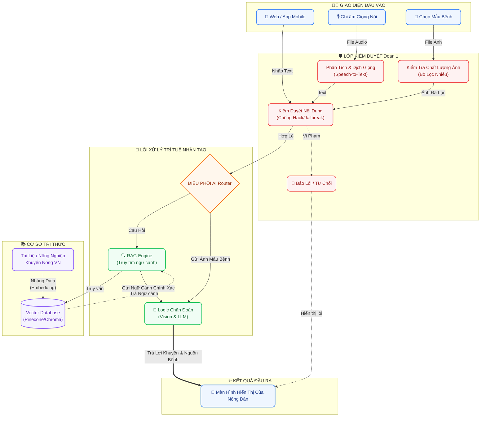

# 🌿 Nông Trí AI - Trợ lý Nông nghiệp Thông minh

Chào mừng bạn đến với dự án **Nông Trí AI** (ArgiAI). Đây là nền tảng ứng dụng công nghệ Trí tuệ Nhân tạo (AI) giúp bà con nông dân chẩn đoán sâu bệnh, tra cứu cẩm nang canh tác và nhận tư vấn trực tiếp từ Chuyên gia AI theo thời gian thực.

Dự án được cấu trúc theo mô hình **Microservices**, phân tách rõ ràng giữa giao diện người dùng (Frontend) và máy chủ xử lý dữ liệu (Backend).

---

## 🛠 Công nghệ sử dụng (Tech Stack)

### 📱 Phân hệ Frontend
- **Framework:** Next.js 15+ (App Router), React 19.
- **Kiến trúc:** Domain-Driven Design (DDD) + Clean Architecture + Dependency Injection (thông qua Custom Hooks/Context API).
- **State Management:** Zustand (Global) & React Query (Server).
- **UI/UX & Animation:** Tailwind CSS, Framer Motion, Lucide React, Font Be Vietnam Pro.

### ⚙️ Phân hệ Backend
- **Framework:** FastAPI (Python), Async.
- **Kiến trúc:** Domain-Driven Design (DDD) + Clean Architecture + Dependency Injection (DI).
- **LLM văn bản:** Ollama tự host (mặc định `qwen2.5:3b`) qua module `ml_agri_chat` — chạy cục bộ, không phụ thuộc API trả phí.
- **Phân loại ảnh bệnh:** Mô hình thị giác Keras nội bộ (`vision_model.CoffeeVisionClassifier`).
- **Vector Database:** ChromaDB (lưu trữ cục bộ, thay thế Pinecone). Lõi RAG hiện dùng embedding hashing nội bộ; kế hoạch nâng cấp sang `sentence-transformers` đa ngôn ngữ.
- **Bảo mật:** PromptGuard (`prompt_guard.py`), kiểm tra chất lượng ảnh (`clean_img.py`), header `X-Admin-Token` cho mọi endpoint ghi/quản trị.

> **Roadmap (chưa implement, đừng quote như fact):** Faster-Whisper offline cho Voice-to-Text, LangGraph cho orchestrator phức tạp, Gemini Vision API như fallback cloud. Các dependency tương ứng được tháo khỏi `requirements.txt` cho đến khi tích hợp thật.

---

## 🏗 Kiến trúc & Cấu trúc Thư mục (Architecture & Directory Tree)

### 1. Sơ đồ Luồng dữ liệu (Data Flow & Dependency Rule)



### 2. Cây thư mục (Directory Tree)

Toàn bộ mã nguồn dự án được đặt trong thư mục gốc `ArgiAI/` với 2 phân hệ chính được cấu trúc theo DDD:

```text
ArgiAI/
├── data/                 # 🗄️ Dữ liệu hệ thống (Vector DB ChromaDB, local development)
├── docs/                 # 📚 Tài liệu, thiết kế, luồng dữ liệu và kế hoạch
├── plan/                 # 🗓️ Thư mục chứa các bản kế hoạch chi tiết
├── frontend/             # 📱 Giao diện Web App (Next.js + Kiến trúc DDD)
│   └── src/
│       ├── app/          # Next.js App Router (Pages, Layouts)
│       ├── core/         # Lõi hệ thống (Cấu hình, HTTP client)
│       ├── lib/          # Tiện ích dùng chung (Utils, hooks)
│       ├── modules/      # Các Domain nghiệp vụ (chat, diagnostics, handbook)
│       └── shared/       # UI Components dùng chung
├── admin/                # 🛠️ Giao diện quản trị dữ liệu/RAG/ops (Vite + React)
│
├── backend/              # ⚙️ Hệ thống API Server (FastAPI + Clean Architecture)
│   ├── app/
│   │   ├── core/         # Lõi hệ thống (Config env, Dependency Injection)
│   │   ├── ml_agri_chat/ # Runtime ML-Agri-Chat tích hợp cho admin/RAG/crawl/ops
│   │   ├── modules/      # Các Domain nghiệp vụ (chat, diagnostics, handbook)
│   │   ├── services/     # Các Service dùng chung (LLM, Vision, v.v.)
│   │   └── shared/       # Tiện ích dùng chung của backend
│   └── requirements.txt  # Thư viện Python
│
├── docker-compose.yml    # File cấu hình chạy toàn bộ hệ thống (Docker)
├── .env.example          # Mẫu cấu hình biến môi trường toàn hệ thống
├── start.sh              # 🚀 Script khởi chạy dự án tiện lợi
├── TODO.md               # 📝 Danh sách các công việc còn lại (Lộ trình)
└── README.md             # 📍 Tài liệu tổng quan dự án
```

---

## 🚀 Hướng dẫn Cài đặt & Khởi chạy (Docker-Only)

Để đảm bảo dự án hoạt động ổn định 100% trên mọi hệ điều hành (Windows, MacOS, Linux) và tránh các lỗi cài đặt thư viện lõi (`ffmpeg`, thư viện Python, Node.js), Nông Trí AI **chỉ hỗ trợ duy nhất phương thức khởi chạy thông qua Docker**.

### Yêu cầu duy nhất
- Máy tính của bạn đã cài đặt [Docker Desktop](https://www.docker.com/products/docker-desktop/) (hoặc Docker Engine).
- Backend runtime chuẩn của dự án là **Python 3.11**. Repo đã có `.python-version` để các công cụ như pyenv/asdf tự chọn đúng version khi cần chạy local.

### Các bước khởi chạy

Mở Terminal tại **thư mục gốc** của dự án (ArgiAI) và thực hiện các lệnh sau:

```bash
# 1. Tạo file cấu hình môi trường từ file mẫu
cp .env.example .env

# 2. Mở file .env và điền GEMINI_API_KEY của bạn vào

# 3. Build và khởi chạy toàn bộ hệ thống (Web, API, Vector DB)
docker compose up -d --build
```

### Truy cập hệ thống
Sau khi Docker hoàn tất việc khởi động, bạn có thể truy cập dự án thông qua trình duyệt:
- 📱 **Giao diện Web Nông dân**: [http://localhost:8080](http://localhost:8080)
- 🛠️ **Giao diện Admin**: [http://localhost:8082](http://localhost:8082)
- ⚙️ **Hệ thống API (Swagger Docs)**: [http://localhost:8081/docs](http://localhost:8081/docs)

### Các nhóm chức năng chính

- **Ứng dụng nông dân (`frontend/`)**: chat, chẩn đoán ảnh, cẩm nang. Phần này dùng API chuẩn hiện tại dưới `/api/v1/chat`, `/api/v1/diagnostics`, `/api/v1/handbook`.
- **Admin vận hành (`admin/`)**: dashboard dữ liệu, research/crawl nguồn, ops console, báo cáo RAG. Admin gọi backend qua `/api/v1/ml-agri`.
- **Backend lõi (`backend/app/modules/`)**: các module DDD hiện có của dự án.
- **Backend ML-Agri tích hợp (`backend/app/ml_agri_chat/`)**: các năng lực được đưa từ `ML-Agri-Chat`, gồm RAG fallback, ingest/crawl tài liệu, data quality, ops events, diagnose image placeholder và bộ dữ liệu mẫu.

### Lưu ý backend local

Backend nên chạy bằng Docker để tránh lệch version Python/native package giữa các máy. Nếu cần chạy local, bắt buộc tạo virtualenv bằng Python 3.11:

```bash
cd backend
python3.11 -m venv .venv
source .venv/bin/activate
pip install -r requirements.txt
uvicorn app.main:app --host 127.0.0.1 --port 8081
```

Không dùng Python 3.14 cho backend hiện tại vì một số package native như `pydantic-core`, `Pillow`, `chromadb` có thể không cài được theo lock hiện tại. Khi thiếu dependency, backend chỉ bật chế độ admin read-only fallback để giao diện không chết fetch; trạng thái chuẩn khi chạy đúng môi trường phải là `status: "ok"` tại `/api/v1/ml-agri/health`.

*Lưu ý: Để dừng hệ thống một cách an toàn, sử dụng lệnh: `docker compose down`.*

---
*Dự án Nông Trí AI - Đồng hành cùng nền nông nghiệp Việt Nam.* 🌾
