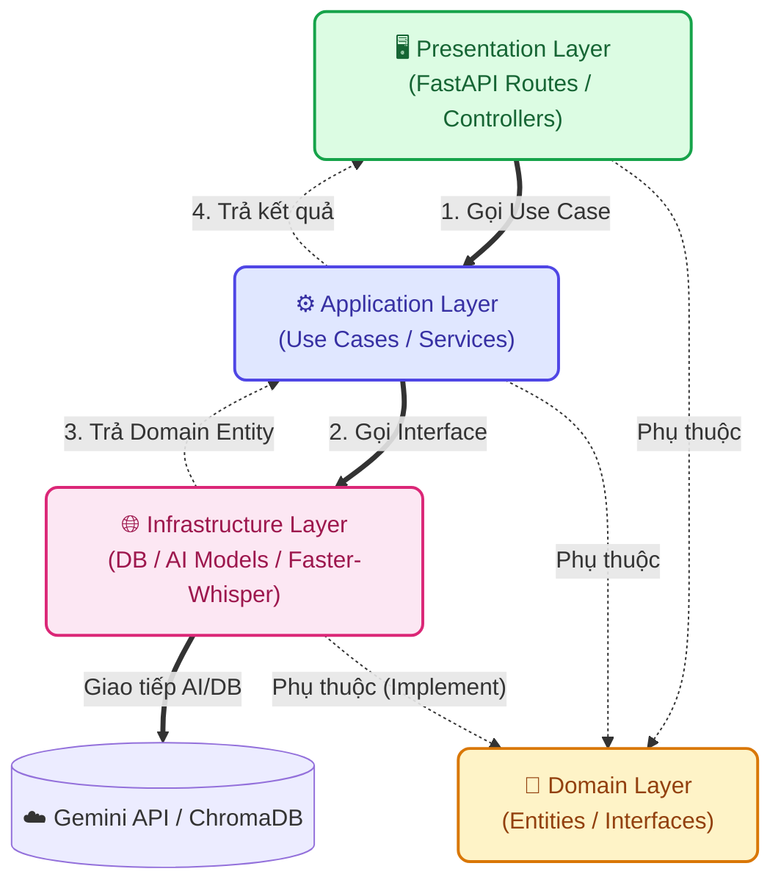

# ⚙️ Phân hệ Backend - Nông Trí AI

Đây là phân hệ API Server (Backend) của dự án **Nông Trí AI**, được xây dựng trên nền tảng **FastAPI (Python)** và áp dụng triệt để kiến trúc **Domain-Driven Design (DDD) + Clean Architecture**.

Mục tiêu chính của Backend là xử lý luồng Logic nghiệp vụ AI (Chẩn đoán ảnh sâu bệnh, Phân tích Giọng nói, Truy xuất Cẩm nang Nông nghiệp) với chi phí tối ưu nhất nhờ việc ứng dụng tối đa các giải pháp **Mã nguồn mở (Open Source)**.

---

## 🛠 Công nghệ sử dụng (Tech Stack)

- **Framework:** FastAPI (Python) siêu tốc độ, hỗ trợ Async.
- **Kiến trúc:** Domain-Driven Design (DDD) kết hợp Backend Clean Architecture. Tích hợp sẵn cơ chế **Dependency Injection** qua `Depends()`.
- **Trí tuệ nhân tạo (Lõi LLM & Vision):** Gemini 1.5 Flash (Xử lý ảnh và phân tích ngữ cảnh RAG cực tốt, tiết kiệm chi phí).
- **Voice-to-Text (Offline):** Faster-Whisper (Giải pháp mã nguồn mở chạy trực tiếp trên CPU, nhận diện tiếng Việt cực chuẩn mà không tốn phí API).
- **Vector Database (Mã nguồn mở):** ChromaDB lưu trữ cục bộ, phục vụ kiến trúc RAG không giới hạn.
- **AI Orchestrator:** LangChain/LangGraph điều phối luồng kiểm duyệt và tạo chuỗi suy luận.

---

## 🏗 Kiến trúc & Cấu trúc Thư mục (Architecture & Directory Tree)

Dự án áp dụng chia tách theo các miền nghiệp vụ (Domains), giúp mã nguồn dễ mở rộng, dễ bảo trì và dễ dàng test độc lập.

```text
backend/
├── app/
│   ├── main.py                    # Lớp Framework (Khởi chạy FastAPI, cấu hình CORS & Routers)
│   ├── core/                      # Thiết lập lõi toàn cục (Config Env, Dependency Injection)
│   ├── shared/                    # Error Handlers, HTTP Clients, Interface dùng chung
│   └── modules/                   # Các phân hệ nghiệp vụ chính (chat, diagnostics, handbook)
│       ├── domain/                # Entities, Types, Interfaces (Tầng trung tâm)
│       ├── application/           # Logic ứng dụng, Use Cases
│       ├── infrastructure/        # Giao tiếp Database, AI Models, DTOs, Mappers
│       └── presentation/          # FastAPI Routes (Controllers) chuyên biệt của module
│
├── requirements.txt               # Các thư viện Python cần thiết
├── Dockerfile                     # Đóng gói API Server
└── README.md                      # Tài liệu cấu trúc chi tiết Backend
```

### Sơ đồ Luồng dữ liệu (Dependency Rule)

Quy tắc cốt lõi: Các tầng bên ngoài (Presentation, Infrastructure) đều phụ thuộc vào tầng bên trong (Domain). Tầng Domain hoàn toàn độc lập với mọi Framework bên ngoài.



---

## 🚀 Hướng dẫn Cài đặt & Khởi chạy (Local Development)

### 1. Khởi chạy bằng Docker Compose (Khuyên dùng)
Nếu bạn muốn chạy song song cả Frontend và Backend cực kỳ tiện lợi:
Vui lòng di chuyển ra **Thư mục gốc (Root)** của toàn bộ dự án Nông Trí AI và gõ lệnh:

```bash
docker compose up -d --build
```

*Lưu ý: Hệ thống sẽ được bật ở cổng `8000` đối với Backend.*

### 2. Khởi chạy Local (Môi trường Dev)
Mở Terminal và đứng tại thư mục `backend/`, thực hiện các bước sau:

```bash
# 1. Tạo môi trường ảo (Virtual Environment)
python3 -m venv venv
source venv/bin/activate  # (Với Windows: venv\Scripts\activate)

# 2. Cài đặt thư viện (Yêu cầu máy cài sẵn `ffmpeg` cho faster-whisper)
pip install -r requirements.txt

# 3. Thiết lập Biến môi trường
cp .env.example .env

# 4. Chạy Server
uvicorn app.main:app --reload --host 0.0.0.0 --port 8000
```

Sau đó truy cập **Swagger UI** tại: [http://localhost:8000/docs](http://localhost:8000/docs) để test các APIs.
