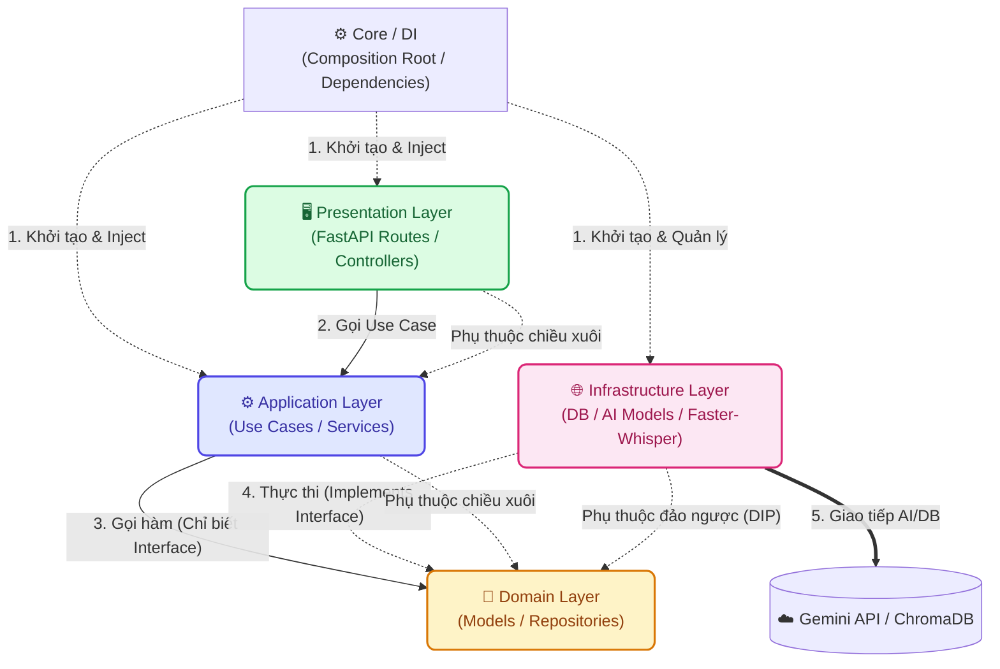

# ⚙️ Phân hệ Backend - Nông Trí AI

Đây là phân hệ API Server (Backend) của dự án **Nông Trí AI**, được xây dựng trên nền tảng **FastAPI (Python)** và áp dụng triệt để kiến trúc **Domain-Driven Design (DDD)** kết hợp **Clean Architecture**.

Mục tiêu chính của Backend là xử lý luồng Logic nghiệp vụ AI (Chẩn đoán bệnh thực vật, Phân tích giọng nói, Truy xuất Cẩm nang) với chi phí tối ưu nhất nhờ việc ứng dụng tối đa các giải pháp **Mã nguồn mở (Open Source)**.

---

## 🛠 Công nghệ sử dụng (Tech Stack)

- **Framework:** FastAPI (Python), Async.
- **Kiến trúc:** Domain-Driven Design (DDD) + Clean Architecture + Dependency Injection (DI).
- **Trí tuệ nhân tạo (Vision & LLM):** Gemini 1.5 Flash (Tối ưu chi phí, thay thế bản PRO/OpenAI trong kế hoạch cũ).
- **Xử lý Giọng nói (Voice-to-Text):** Faster-Whisper (Chạy Offline, thay thế FPT.AI).
- **Vector Database:** ChromaDB (Lưu trữ cục bộ, thay thế Pinecone).
- **AI Orchestrator:** LangGraph (Được chọn để quản lý State và luồng Agent phức tạp thay vì LangChain cơ bản).

---

## 🏗 Kiến trúc & Cấu trúc Thư mục (Architecture & Directory Tree)

### 1. Sơ đồ Luồng dữ liệu (Data Flow & Dependency Rule)

Quy tắc cốt lõi: Các tầng bên ngoài (Presentation, Infrastructure) đều phụ thuộc vào tầng bên trong (Domain). Tầng Domain hoàn toàn độc lập với mọi Framework bên ngoài.



### 2. Cây thư mục (Directory Tree)

Dự án áp dụng chia tách theo các miền nghiệp vụ (Domains), giúp mã nguồn dễ mở rộng, dễ bảo trì và test độc lập.

```text
backend/
├── app/
│   ├── main.py                    # Lớp Framework (Khởi chạy FastAPI, cấu hình CORS & Routers)
│   ├── core/                      # Thiết lập lõi toàn cục (Config Env)
│   ├── shared/                    # Các thành phần dùng chung toàn cục
│   │   ├── infrastructure/        # (VD: Khởi tạo Vector DB client)
│   │   ├── errors/
│   │   └── domain/                # Các Interfaces/Models dùng chung toàn cục
│   └── modules/                   # Các phân hệ nghiệp vụ chính (chat, diagnostics, handbook)
│       ├── dependencies.py        # (Mới) Lớp Composition Root, tiêm dependencies cho module
│       ├── domain/
│       │   ├── models.py          # Định nghĩa hình dáng dữ liệu (Domain Models)
│       │   └── repositories.py    # Các hợp đồng (contracts/interfaces) cho Repository
│       ├── application/           # Logic ứng dụng, Use Cases (Services)
│       ├── infrastructure/        # Giao tiếp Database, AI Models, DTOs, Mappers
│       └── presentation/          # FastAPI Routes (Controllers) chuyên biệt của module
│
├── requirements.txt               # Các thư viện Python cần thiết
└── Dockerfile                     # Đóng gói API Server
```

---

## 🚀 Hướng dẫn Cài đặt & Khởi chạy (Docker-Only)

Để giải quyết triệt để các vấn đề cài đặt phức tạp liên quan đến `ffmpeg` (để nhận diện giọng nói) và thiết lập mạng kết nối nội bộ với Vector DB (ChromaDB), phân hệ Backend được cấu hình để **chỉ khởi chạy thông qua Docker Compose** ở thư mục gốc.

Vui lòng tham khảo [👉 Hướng dẫn Khởi chạy tại Tài liệu Gốc](../README.md#🚀-hướng-dẫn-cài-đặt--khởi-chạy-docker-only) để bật toàn bộ hệ thống bằng một dòng lệnh duy nhất.

---
*Dự án Nông Trí AI - Đồng hành cùng nền nông nghiệp Việt Nam.* 🌾
