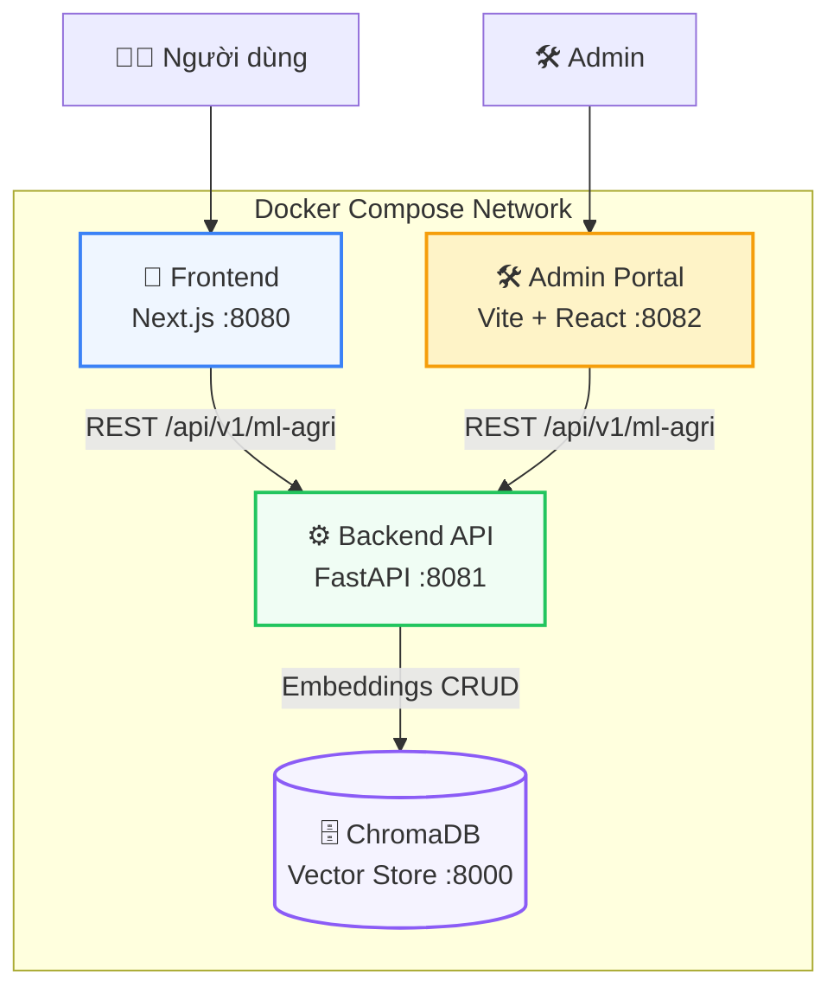

# 🏗 Kiến trúc Hệ thống Nông Trí AI

## Tổng quan

Nông Trí AI được thiết kế theo kiến trúc **Microservices** kết hợp **Domain-Driven Design (DDD)** và **Clean Architecture**. Hệ thống gồm 4 service chính:



## 🧱 Lớp Kiến trúc Backend (Clean Architecture)

Backend tuân thủ nghiêm ngặt **Clean Architecture** với 4 tầng:

```
┌─────────────────────────────────────────────┐
│              PRESENTATION                    │
│  Routers, Schemas, API Endpoints             │
│  → Phụ thuộc vào Application                 │
├─────────────────────────────────────────────┤
│              APPLICATION                     │
│  Use Cases, Services, DTOs                   │
│  → Phụ thuộc vào Domain                      │
├─────────────────────────────────────────────┤
│                DOMAIN                        │
│  Entities, Value Objects, Interfaces         │
│  → KHÔNG phụ thuộc vào tầng nào              │
├─────────────────────────────────────────────┤
│            INFRASTRUCTURE                    │
│  DB Clients, External APIs, File I/O         │
│  → Implement Domain Interfaces               │
└─────────────────────────────────────────────┘
```

### Dependency Rule
- **Presentation** → phụ thuộc vào **Application**
- **Application** → phụ thuộc vào **Domain**
- **Infrastructure** → implement các interface của **Domain**
- **Domain** — KHÔNG phụ thuộc vào bất kỳ tầng nào

### Composition Root
Mỗi module có file `dependencies.py` làm Composition Root, nơi khai báo và wire-up tất cả dependencies theo nguyên tắc Dependency Injection:

```python
# module/chat/dependencies.py
def get_chat_service() -> ChatService:
    repo = ChromaRepository()        # Infrastructure
    advisor = LLMAdvisor()           # Infrastructure
    return ChatService(repo, advisor) # Application
```

## 📂 Cấu trúc Thư mục Chi tiết

```text
ari_ai/
├── frontend/                    # 📱 Ứng dụng web cho nông dân (Next.js 15)
│   └── src/
│       ├── app/                 # App Router: pages, layouts, globals.css
│       │   ├── chat/            # Trang chat với AI
│       │   ├── handbook/        # Trang cẩm nang nông nghiệp
│       │   ├── layout.tsx       # Root layout
│       │   ├── page.tsx         # Home page
│       │   └── not-found.tsx    # 404 page
│       ├── core/                # Lõi hệ thống
│       │   ├── di/              # Dependency Injection container
│       │   ├── domain/          # Domain entities & interfaces
│       │   └── infrastructure/  # HTTP clients, repositories
│       ├── lib/                 # Shared utilities
│       ├── modules/             # Các domain nghiệp vụ
│       │   ├── chat/            # Module chat
│       │   ├── diagnostics/     # Module chẩn đoán ảnh
│       │   ├── handbook/        # Module cẩm nang
│       │   └── home/            # Module trang chủ
│       └── shared/              # UI components dùng chung
│           ├── components/      # Button, Card, Input...
│           ├── hooks/           # Custom hooks
│           └── providers/       # React context providers
│
├── admin/                       # 🛠 Giao diện quản trị (Vite + React 18)
│   └── src/
│       ├── App.jsx              # Root component + theme
│       ├── main.jsx             # Entry point
│       ├── index.css            # Tailwind + global styles
│       └── components/
│           ├── AdminPortal.jsx  # Layout + navigation
│           ├── DataDashboard.jsx     # Dashboard dữ liệu
│           ├── TrustDashboard.jsx    # AI Trust & Governance
│           ├── ResearchPage.jsx      # Crawl & research
│           ├── ReportsDashboard.jsx  # Báo cáo RAG
│           ├── OpsConsole.jsx        # Ops console
│           └── BrandMark.jsx         # Branding component
│
├── backend/                     # ⚙️ API Server (FastAPI + Python 3.11)
│   ├── app/
│   │   ├── main.py              # FastAPI app factory + middleware
│   │   ├── core/
│   │   │   └── config.py        # Pydantic Settings, env vars
│   │   ├── ml_agri_chat/        # ML-Agri-Chat Runtime (module chính)
│   │   │   ├── router.py        # API endpoints (chat, crawl, trust...)
│   │   │   ├── _routes/         # Sub-routers theo domain
│   │   │   ├── data/            # Dữ liệu mẫu, knowledge base
│   │   │   │   ├── raw_documents/
│   │   │   │   ├── cleaned_documents/
│   │   │   │   ├── chunks/
│   │   │   │   ├── vector_store/
│   │   │   │   ├── evaluation/
│   │   │   │   ├── knowledge_base/
│   │   │   │   └── crawl_candidates/
│   │   │   ├── ml_pipeline/     # Pipeline ML
│   │   │   │   ├── crawler/     # Internet crawler
│   │   │   │   ├── models/      # ML models
│   │   │   │   ├── dataset/     # Image dataset
│   │   │   │   └── reports/     # Generated reports
│   │   │   └── modules/         # Business logic modules
│   │   │       ├── rag.py             # RAG Engine
│   │   │       ├── llm_advisor.py     # LLM Advisor
│   │   │       ├── intent_classifier.py
│   │   │       ├── prompt_guard.py    # Security filter
│   │   │       ├── clean_img.py       # Image quality check
│   │   │       ├── data_governance.py # Trust reporting
│   │   │       ├── data_quality.py
│   │   │       ├── data_ingestion.py
│   │   │       ├── document_chunking.py
│   │   │       ├── internet_crawler.py
│   │   │       ├── source_policy.py   # Source reliability policy
│   │   │       ├── taxonomy.py        # Agricultural taxonomy
│   │   │       ├── vision_model.py    # Coffee disease classifier
│   │   │       ├── text_cleaning.py
│   │   │       ├── accent_restoration.py
│   │   │       ├── search_discovery.py
│   │   │       └── logger.py
│   │   ├── modules/            # (Legacy - đã gỡ bỏ)
│   │   ├── services/           # Shared services
│   │   └── shared/             # Shared utilities
│   │       ├── latency.py      # Latency tracking middleware
│   │       ├── rate_limit.py   # Rate limiting
│   │       ├── text_utils.py   # Text processing
│   │       ├── upload.py       # File upload handling
│   │       ├── domain/         # Shared domain types
│   │       ├── errors/         # Error handling
│   │       └── infrastructure/ # Vector DB client, etc.
│   ├── tests/                  # Test suite
│   └── requirements.txt        # Python dependencies
│
├── data/
│   └── chromadb/               # ChromaDB persistent storage
│
├── docs/                       # 📚 Tài liệu dự án
│   ├── README.md               # Index tài liệu
│   ├── architecture.md         # File này
│   ├── flow/                   # Sơ đồ luồng dữ liệu
│   ├── modules/                # Tài liệu từng module
│   ├── planning/               # Kế hoạch triển khai
│   │   ├── KeHoachTrienKhai_NongTri.html
│   │   └── backend-clean-arch-refactor.md
│   └── trust-ai-governance.md  # AI Trust documentation
│
├── plan/                       # Thư mục kế hoạch bổ sung
├── tmp/                        # Files tạm
│   └── bao-cao/
│
├── docker-compose.yml          # Docker Compose configuration
├── Makefile                    # Make commands for dev workflow
├── start.sh                    # One-click startup script
├── .env.example                # Environment variables template
└── TODO.md                     # Lộ trình phát triển
```

## 🔗 Giao tiếp giữa các Service

| Từ | Đến | Protocol | Mục đích |
|----|-----|----------|----------|
| Frontend (:8080) | Backend (:8081) | REST/JSON | Chat, chẩn đoán, cẩm nang |
| Admin (:8082) | Backend (:8081) | REST/JSON | Quản lý dữ liệu, crawl, trust report |
| Backend (:8081) | ChromaDB (:8000) | HTTP/gRPC | Vector embeddings CRUD |

Tất cả giao tiếp đều thông qua Docker network `argiai_net` (bridge).

## 🛡 Middleware Stack (Backend)

Request đi qua các middleware theo thứ tự:

```
Request → LatencyMiddleware → SlowAPI (Rate Limit) → CORS → Router → Response
```

- **LatencyMiddleware**: Đo thời gian xử lý cho mọi request
- **SlowAPI**: Rate limiting (configurable per endpoint)
- **CORS**: Cho phép frontend/admin origins

## 🔑 Nguyên tắc Thiết kế Chính

### 1. Self-Hosted AI First
Toàn bộ pipeline AI chạy cục bộ:
- **LLM văn bản**: Ollama (qwen2.5:3b) — không phụ thuộc API trả phí
- **Phân loại ảnh**: Keras Vision Model nội bộ
- **Vector DB**: ChromaDB local
- **Embedding**: Internal hashing embedder (kế hoạch: sentence-transformers)

### 2. Privacy by Design
- Data minimization: chỉ thu thập tối thiểu
- PII anonymization trước khi log
- Người dùng có quyền xóa lịch sử
- Không gửi dữ liệu ra dịch vụ bên thứ ba

### 3. AI Safety (6 Trục AI)
Hệ thống được thiết kế với 6 trục AI từ đầu:
1. **Robustness**: Chống prompt injection, lọc ảnh nhiễu
2. **Reliability**: RAG chống ảo giác, chỉ trả lời từ nguồn chính thống
3. **Explainability**: Trích dẫn nguồn, giải thích lý do chẩn đoán
4. **Bias & Fairness**: Chống thiên vị vùng miền, hỗ trợ đa phương ngữ
5. **Privacy**: Dữ liệu cục bộ, không gửi ra ngoài
6. **Social Impact**: Miễn phí, tối ưu cho nông dân nhỏ lẻ

---

← [Về Trang chủ Tài liệu](./README.md)
