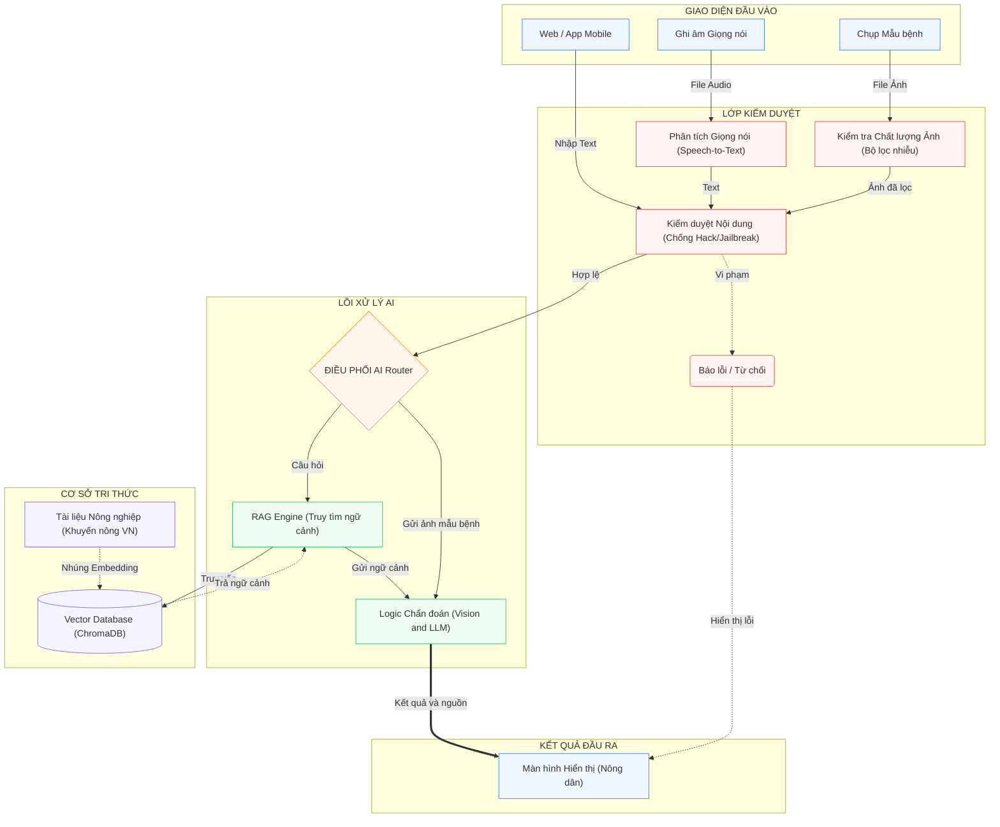

# 🔄 Luồng Dữ liệu Hệ thống

## Sơ đồ Luồng End-to-End



## 🎯 Các Luồng Xử lý Chính

### Luồng 1: Hỏi đáp Văn bản (Chat)

```
Người dùng nhập text
    → PromptGuard (kiểm duyệt nội dung) 
        → Intent Classifier (phân loại câu hỏi)
            → [Nếu là câu hỏi nông nghiệp]
                → RAG Engine (truy xuất ngữ cảnh từ Vector DB)
                → LLM Advisor (sinh câu trả lời + trích dẫn nguồn)
                → Hiển thị kết quả
            → [Nếu không phải]
                → Từ chối, gợi ý chủ đề nông nghiệp
```

### Luồng 2: Chẩn đoán Ảnh (Diagnostics)

```
Người dùng chụp/gửi ảnh
    → CleanImg (kiểm tra chất lượng: mờ, rung, sai góc)
        → [Nếu ảnh không đạt] → Yêu cầu chụp lại
        → [Nếu ảnh đạt]
            → Vision Model (CoffeeVisionClassifier - Keras)
                → Phân loại bệnh + độ tin cậy
                → LLM Advisor (giải thích kết quả + khuyến nghị)
                → Hiển thị chẩn đoán + nguồn tham khảo
```

### Luồng 3: Giọng nói (Voice - kế hoạch)

```
Người dùng ghi âm
    → Faster-Whisper (Speech-to-Text offline)
        → Accent Restoration (khôi phục dấu tiếng Việt)
            → PromptGuard
                → [Tiếp tục như Luồng 1]
```

### Luồng 4: Admin - Crawl & Ingest

```
Admin chọn URL / Upload document
    → Internet Crawler (tải nội dung)
        → Text Cleaning (làm sạch)
            → Source Policy Check (đánh giá độ tin cậy nguồn)
                → Document Chunking (chia nhỏ)
                    → Embedding Generation
                        → Lưu vào Vector DB (ChromaDB)
```

## 🔍 Chi tiết các Module trong Luồng

| Module | Vị trí | Chức năng |
|--------|--------|-----------|
| PromptGuard | `ml_agri_chat/modules/prompt_guard.py` | Lọc prompt injection, từ chối câu hỏi không liên quan |
| CleanImg | `ml_agri_chat/modules/clean_img.py` | Đánh giá chất lượng ảnh đầu vào |
| IntentClassifier | `ml_agri_chat/modules/intent_classifier.py` | Phân loại intent câu hỏi |
| RAG Engine | `ml_agri_chat/modules/rag.py` | Retrieval-Augmented Generation |
| LLM Advisor | `ml_agri_chat/modules/llm_advisor.py` | Sinh câu trả lời có kiểm soát |
| Vision Model | `ml_agri_chat/modules/vision_model.py` | Phân loại bệnh cây trồng từ ảnh |
| Source Policy | `ml_agri_chat/modules/source_policy.py` | Chính sách đánh giá độ tin cậy nguồn |
| Data Governance | `ml_agri_chat/modules/data_governance.py` | Sinh báo cáo Trust & Governance |

---

← [Về Trang chủ Tài liệu](./README.md) | [Tiếp: Pipeline RAG](./rag-pipeline.md) →
