# 🔍 Pipeline RAG (Retrieval-Augmented Generation)

## Tổng quan

RAG Pipeline là trái tim của Nông Trí AI, đảm bảo mọi câu trả lời đều dựa trên tài liệu nông nghiệp chính thống, chống "ảo giác" (hallucination) của LLM.

```mermaid
graph LR
    subgraph Ingest["INGEST (Offline)"]
        Crawl["Crawl (URL/Upload)"]
        Clean["Text Cleaning"]
        Policy["Source Policy (Đánh giá tin cậy)"]
        Chunk["Chunking (Chia nhỏ văn bản)"]
        Embed["Embedding (Text sang Vector)"]
        Store[("ChromaDB (Vector Store)")]

        Crawl --> Clean --> Policy --> Chunk --> Embed --> Store
    end

    subgraph Retrieval["RETRIEVAL (Online)"]
        Query["User Query"]
        QEmbed["Query Embedding"]
        Search["Similarity Search (Top-K Chunks)"]
        Rerank["Re-rank (theo relevance)"]

        Query --> QEmbed --> Search --> Rerank
    end

    subgraph Generation["GENERATION"]
        Context["Retrieved Context"]
        Prompt["System Prompt (+ Context + Question)"]
        LLM["LLM - Ollama"]
        Cite["Citation (+ Source Attribution)"]

        Context --> Prompt --> LLM --> Cite
    end

    Store -.->|"Vector Search"| Search
    Rerank --> Context

    style Crawl fill:#f0fdf4,stroke:#22c55e
    style Clean fill:#f0fdf4,stroke:#22c55e
    style Chunk fill:#f0fdf4,stroke:#22c55e
    style Embed fill:#f0fdf4,stroke:#22c55e
    style Store fill:#f0fdf4,stroke:#22c55e
    style Policy fill:#fef2f2,stroke:#ef4444
    style Query fill:#eff6ff,stroke:#3b82f6
    style QEmbed fill:#eff6ff,stroke:#3b82f6
    style Search fill:#eff6ff,stroke:#3b82f6
    style Rerank fill:#eff6ff,stroke:#3b82f6
    style Context fill:#fff7ed,stroke:#f97316
    style Prompt fill:#fff7ed,stroke:#f97316
    style LLM fill:#fff7ed,stroke:#f97316
    style Cite fill:#fff7ed,stroke:#f97316
```



## 📥 Giai đoạn 1: Ingest Pipeline

### 1.1 Thu thập Dữ liệu (Crawl)

**Nguồn dữ liệu chính thống:**
- `mard.gov.vn` — Bộ Nông nghiệp & PTNT
- `khuyennongvn.gov.vn` — Trung tâm Khuyến nông Quốc gia
- `wasi.org.vn` — Viện Khoa học Kỹ thuật Nông Lâm nghiệp Tây Nguyên
- `vaas.vn` — Viện Khoa học Nông nghiệp Việt Nam
- File PDF/Word upload từ admin

**Module:** `ml_agri_chat/modules/internet_crawler.py`

### 1.2 Làm sạch Văn bản (Text Cleaning)

- Loại bỏ header/footer thừa
- Chuẩn hóa Unicode tiếng Việt
- Loại bỏ ký tự đặc biệt, HTML tags
- Tách đoạn theo cấu trúc tài liệu

**Module:** `ml_agri_chat/modules/text_cleaning.py`

### 1.3 Đánh giá Nguồn (Source Policy)

Mỗi nguồn được đánh giá theo whitelist:

| Mức độ | Mô tả | Ví dụ |
|--------|-------|-------|
| Official | Cơ quan nhà nước, viện nghiên cứu | mard.gov.vn, vaas.vn |
| Semi-official | Tổ chức nông nghiệp uy tín | wasi.org.vn |
| Internet | Nguồn web thông thường | Blog, diễn đàn |
| Blocked | Thương mại, mạng xã hội | Shopee, Facebook |

**Module:** `ml_agri_chat/modules/source_policy.py`

### 1.4 Chia nhỏ Văn bản (Chunking)

- Kích thước chunk: ~500 tokens
- Overlap: 50 tokens (giữ ngữ cảnh liên tục)
- Metadata: tên tài liệu, trang, tác giả, URL gốc

**Module:** `ml_agri_chat/modules/document_chunking.py`

### 1.5 Embedding & Lưu trữ

Hiện tại dùng **internal hashing embedder**. Kế hoạch nâng cấp lên `sentence-transformers` đa ngôn ngữ (paraphrase-multilingual).

**Vector DB:** ChromaDB — lưu trữ cục bộ, collection `agriculture_kb`.

## 🔍 Giai đoạn 2: Retrieval

### 2.1 Query Processing

1. Nhận câu hỏi từ người dùng (đã qua PromptGuard)
2. Intent Classification: phân loại câu hỏi nông nghiệp
3. Accent Restoration: khôi phục dấu tiếng Việt nếu thiếu

### 2.2 Vector Search

1. Embed query → vector
2. Similarity search trong ChromaDB (cosine similarity)
3. Top-K chunks (K=5 mặc định)
4. Re-rank theo relevance score + source reliability

### 2.3 Context Assembly

- Ghép các chunk thành context window
- Sắp xếp theo relevance score giảm dần
- Gắn metadata nguồn cho mỗi chunk

## 🤖 Giai đoạn 3: Generation

### 3.1 System Prompt

```
Bạn là chuyên gia nông nghiệp. CHỈ trả lời dựa trên context được cung cấp.
Nếu không có đủ thông tin, hãy nói "Tôi cần thêm thông tin về...".
LUÔN trích dẫn nguồn cho mỗi thông tin.
```

### 3.2 Controlled Generation

**Module:** `ml_agri_chat/modules/llm_advisor.py`

- Inject context + system prompt + user question
- Temperature: 0.3 (low creativity, high factual accuracy)
- Max tokens: 1024
- Post-processing: kiểm tra citation, format output

### 3.3 Output Format

```json
{
  "answer": "Dựa trên triệu chứng đốm nâu trên lá...",
  "confidence": 0.85,
  "sources": [
    {
      "title": "Sổ tay Bệnh cây Cà phê - trang 15",
      "url": "wasi.org.vn/...",
      "reliability": "official"
    }
  ],
  "disclaimer": "Đây là tư vấn ban đầu, không thay thế chuyên gia khuyến nông."
}
```

## 📊 Giám sát Chất lượng RAG

### Trust Report Metrics

| Metric | Mô tả | Target |
|--------|-------|--------|
| reviewed_source_share | Tỷ lệ nguồn chính thống | > 60% |
| internet_source_share | Tỷ lệ nguồn internet | < 25% |
| topic_coverage_rate | Độ phủ chủ đề nông nghiệp | > 85% |
| needs_review_source_count | Số nguồn đang bị giữ review | → 0 |
| high_risk_warning_total | Số cảnh báo rủi ro cao | → 0 |

### Evaluation Pipeline

**Module:** `ml_agri_chat/modules/data_quality.py`

- Bộ test cases đánh giá retrieval quality
- Tính toán recall@k, precision@k
- Monitoring embedding drift

---

← [Luồng Dữ liệu](./overview.md) | [Về Trang chủ Tài liệu](./README.md) →
