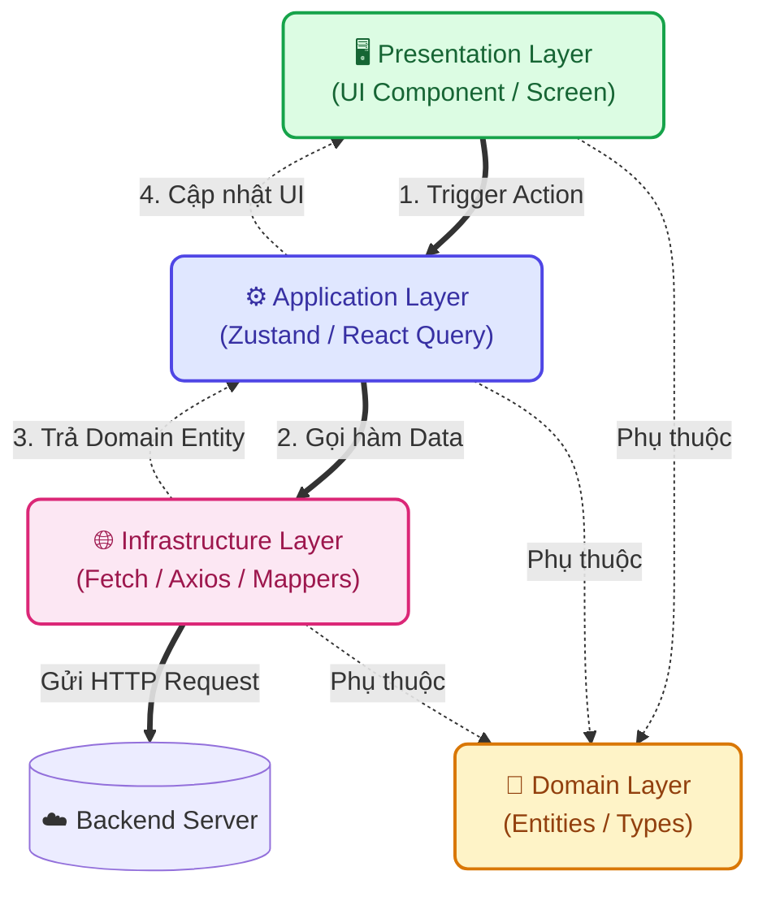

# 🌾 Nông Trí AI - Phân hệ Frontend

Đây là phân hệ Frontend của dự án **Nông Trí AI**, được phát triển dựa trên Next.js (App Router) và áp dụng kiến trúc **Domain-Driven Design (DDD) + Clean Architecture**.

## 🏗 Cấu trúc Thư mục

Dự án áp dụng chia tách theo các miền nghiệp vụ (Domains), giúp mã nguồn dễ dàng mở rộng, bảo trì và dễ dàng test:

- `src/app/`: Lớp Framework (Routing & Providers). Chứa các trang Server Components tối giản.
- `src/core/`: Các thiết lập lõi toàn cục (Error Handling, HTTP Client, Providers).
- `src/shared/`: Các UI components, hooks và utils dùng chung cho toàn bộ dự án (ví dụ: BottomNav, TopHeader).
- `src/modules/`: Chứa các phân hệ nghiệp vụ chính (chat, diagnostics, handbook), mỗi phân hệ gồm 4 tầng:
  - **`domain/`**: Chứa Entities, Types, Interfaces (Tầng trung tâm, không phụ thuộc Framework).
  - **`application/`**: Nơi chứa logic ứng dụng, use cases (Zustand Stores, React Query hooks).
  - **`infrastructure/`**: Giao tiếp API, DTOs, Mappers mô phỏng data.
  - **`presentation/`**: UI Components chuyên biệt của module đó (chỉ render UI, không gọi trực tiếp Axios/Fetch).

### Sơ đồ Luồng dữ liệu (Dependency Rule)

Quy tắc cốt lõi: Các tầng bên ngoài phụ thuộc vào tầng bên trong (Domain). UI không bao giờ được gọi trực tiếp API.



## 🚀 Cài đặt & Khởi chạy

```bash
# 1. Cài đặt các gói phụ thuộc
npm install

# 2. Khởi chạy server ở chế độ phát triển (Local)
npm run dev
```

Sau khi khởi chạy, truy cập vào [http://localhost:3000](http://localhost:3000) để xem ứng dụng.

## 🛠 Công nghệ cốt lõi (Tech Stack)
- **Framework:** Next.js 15+ (App Router), React
- **State Management:** Zustand
- **Data Fetching/Caching:** React Query (TanStack Query)
- **Styling:** Tailwind CSS
- **Font:** Be Vietnam Pro
- **Icons:** Lucide React
