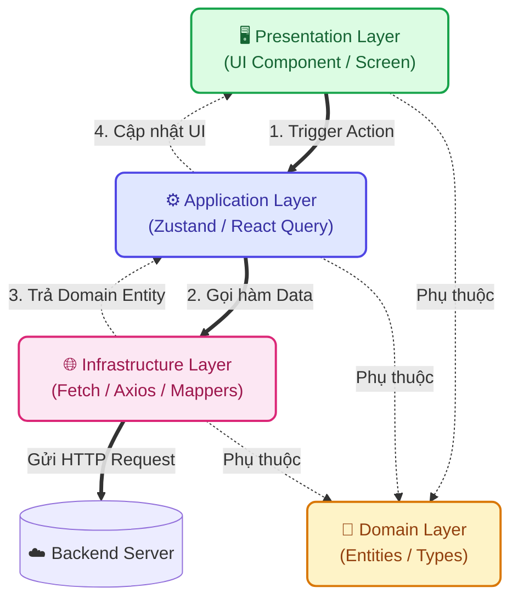

# 📱 Phân hệ Frontend - Nông Trí AI

Đây là phân hệ Giao diện người dùng của dự án **Nông Trí AI**, được phát triển dựa trên Next.js (App Router) và áp dụng triệt để kiến trúc **Domain-Driven Design (DDD) + Clean Architecture**.

---

## 🛠 Công nghệ sử dụng (Tech Stack)

- **Framework:** Next.js 15+ (App Router), React 19.
- **Kiến trúc:** Domain-Driven Design (DDD) kết hợp Frontend Clean Architecture.
- **State Management:** Zustand (Global State).
- **Data Fetching/Caching:** React Query (TanStack Query) cho Server State.
- **Styling:** Tailwind CSS.
- **Typography:** Be Vietnam Pro (tối ưu hiển thị tiếng Việt).
- **Animations:** Framer Motion (hiệu ứng chuyển động mượt mà).
- **Icons:** Lucide React.

---

## 🏗 Kiến trúc & Cấu trúc Thư mục (Architecture & Directory Tree)

Dự án áp dụng chia tách theo các miền nghiệp vụ (Domains), giúp mã nguồn dễ mở rộng, dễ bảo trì và test.

```text
frontend/
├── public/               # Tài nguyên hình ảnh, biểu tượng
└── src/
    ├── app/              # Lớp Framework (Routing & Providers, Server Components)
    ├── core/             # Thiết lập lõi toàn cục (Error Handling, HTTP Client)
    ├── shared/           # UI Components, hooks và utils dùng chung (BottomNav, TopHeader)
    └── modules/          # Các phân hệ nghiệp vụ chính (chat, diagnostics, handbook)
        ├── domain/       # Entities, Types, Interfaces (Tầng trung tâm)
        ├── application/  # Logic ứng dụng, Use Cases (Zustand Stores, React Query hooks)
        ├── infrastructure/ # Giao tiếp API, DTOs, Mappers mô phỏng data
        └── presentation/ # UI Components chuyên biệt của module (không gọi trực tiếp Axios/Fetch)
```

### Sơ đồ Luồng dữ liệu (Dependency Rule)

Quy tắc cốt lõi: Các tầng bên ngoài phụ thuộc vào tầng bên trong (Domain). UI không bao giờ được gọi trực tiếp API.



---

## 🚀 Hướng dẫn Cài đặt & Khởi chạy (Local Development)

Mở Terminal và di chuyển vào thư mục `frontend`:

```bash
# 1. Cài đặt các gói phụ thuộc
npm install

# 2. Khởi chạy server ở chế độ phát triển (Local)
npm run dev
```

Sau khi khởi chạy, truy cập vào [http://localhost:3000](http://localhost:3000) để trải nghiệm ứng dụng.
