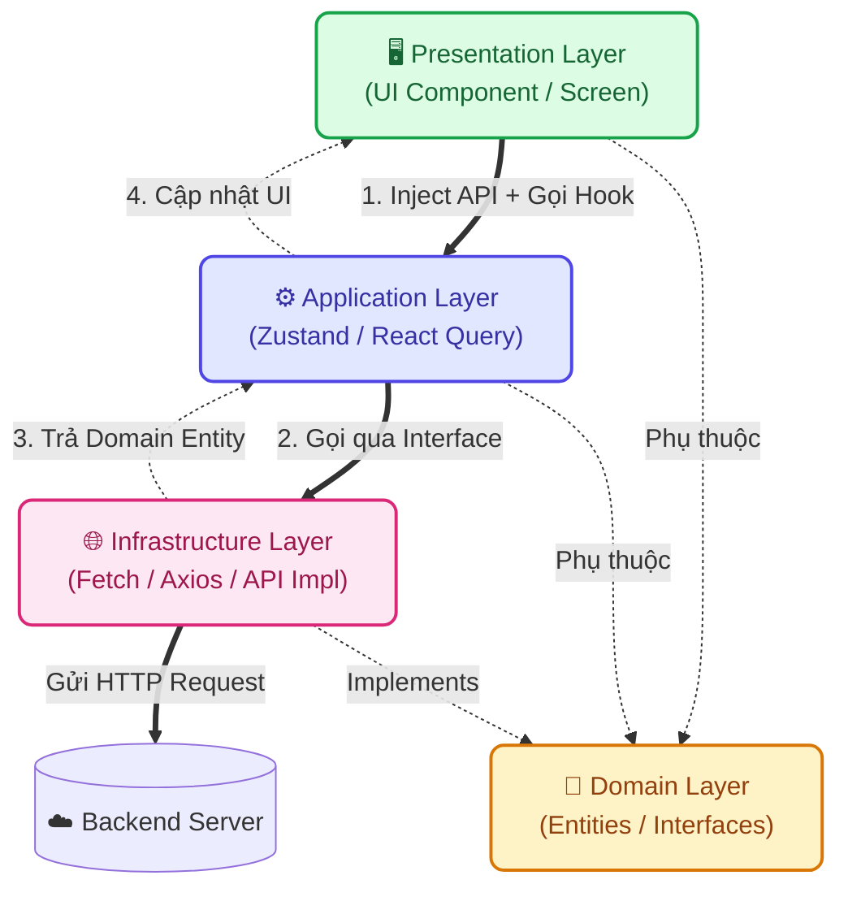

# 📱 Phân hệ Frontend - Nông Trí AI

Đây là phân hệ Giao diện người dùng của dự án **Nông Trí AI**, được phát triển dựa trên Next.js (App Router) và áp dụng triệt để kiến trúc **Domain-Driven Design (DDD)** kết hợp **Clean Architecture**.

---

## 🛠 Công nghệ sử dụng (Tech Stack)

- **Framework:** Next.js 15+ (App Router), React 19.
- **Kiến trúc:** Domain-Driven Design (DDD) + Clean Architecture + Dependency Injection (thông qua Custom Hooks/Context API).
- **State Management:** Zustand (Global) & React Query (Server).
- **UI/UX & Animation:** Tailwind CSS, Framer Motion, Lucide React, Font Be Vietnam Pro.

---

## 🏗 Kiến trúc & Cấu trúc Thư mục (Architecture & Directory Tree)

### 1. Sơ đồ Luồng dữ liệu (Data Flow & Dependency Rule)

Quy tắc cốt lõi: Các tầng bên ngoài phụ thuộc vào tầng bên trong (Domain). UI không bao giờ được gọi trực tiếp API.



### 2. Cây thư mục (Directory Tree)

Dự án áp dụng chia tách theo các miền nghiệp vụ (Domains), giúp mã nguồn dễ mở rộng, dễ bảo trì và test.

```text
frontend/
├── public/               # Tài nguyên hình ảnh, biểu tượng
└── src/
    ├── app/              # Lớp Framework (Routing & Providers, Server Components)
    ├── core/             # Thiết lập lõi toàn cục (Error Handling, HTTP Client)
    ├── shared/           # UI Components, hooks và utils dùng chung (BottomNav, TopHeader)
    └── modules/          # Các phân hệ nghiệp vụ chính (chat, diagnostics, handbook)
        ├── domain/       # Tầng trung tâm (Core)
        │   ├── entities/   # Các object, type định nghĩa hình dáng dữ liệu
        │   └── interfaces/ # Các hợp đồng (contracts) cho API / Repository
        ├── application/  # Logic ứng dụng, Use Cases (Zustand Stores, React Query hooks)
        ├── infrastructure/ # Giao tiếp API, implement các interfaces từ domain
        └── presentation/ # UI Components chuyên biệt của module (chỉ render UI)
```

---

## 🚀 Hướng dẫn Cài đặt & Khởi chạy (Docker-Only)

Để đảm bảo tính đồng bộ trên mọi môi trường và tránh các lỗi cấu hình phiên bản Node.js phức tạp, phân hệ Frontend được tự động hoá khởi chạy thông qua **Docker Compose** ở cấp độ dự án.

Vui lòng tham khảo [👉 Hướng dẫn Khởi chạy tại Tài liệu Gốc](../README.md#🚀-hướng-dẫn-cài-đặt--khởi-chạy-docker-only) để bật toàn bộ hệ thống bằng một dòng lệnh duy nhất.

---
*Dự án Nông Trí AI - Đồng hành cùng nền nông nghiệp Việt Nam.* 🌾
